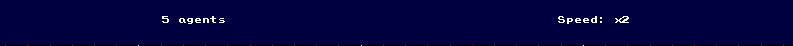

# cellify

Implementation of a very simple open-world cell landscape with resources and agents. The world is a grid with discrete coordinates so as to ease a lot the concerns about motion and paths.

# Installation

- Clone the repo: `git clone git@github.com:Knoblauchpilze/cellify.git`.
- Clone dependencies:
    * [core_utils](https://github.com/Knoblauchpilze/core_utils)
    * [maths_utils](https://github.com/Knoblauchpilze/maths_utils)
- Go to the project's directory `cd ~/path/to/the/repo`.
- Compile: `make run`.

Don't forget to add `/usr/local/lib` to your `LD_LIBRARY_PATH` to be able to load shared libraries at runtime. This is handled automatically when using the `make run` target (which internally uses the [run.sh](https://github.com/Knoblauchpilze/cellify/blob/master/data/run.sh) script).

# General principle

The application is a top-view representation of a grid-like world where agents are evolving. The user can interact with the simulation by increasing its speed or adding elements in the world (such as food sources and obstacles). Each agent is reacting to its surrounding and making decisions based on that.

All in all, the goal of the application was also to create a very simple multi-agents based simulation and see what classes are needed, what structure works well to handle agents behavior etc.

# The world

In the application, the world is composed of several elements.

## General scheduling

The application is built around the [Pixel Game Engine](https://github.com/OneLoneCoder/olcPixelGameEngine). This engine schedules all the processing in one loop and calls the update function at each frame.

### World

We used this scheduling to perform the update of the world. We manage an internal timestamp which provides the time elasped since the beginning of the simulation. We can very easily change the speed of the simulation with this approach. It could technically also be used to rollback to an anterior state (even if not implemented yet).

During each update, the process it to cycle through the elements registered in the world and collect their influences. Each element is executed one after the other and is guaranteed to be called once per frame.

After the update of the elements, we process the influences. This includes:
* spawning new agents.
* deleting ones marked for self-destruction.
* perform update of elements based on influences.

### UI

The game can also be in a paused or active state. None of the menus will be active when the game is paused. The update of the world based on the user update happens before the execution of the frame.

## Obstacle

Prevents anything from going through it. This can be used to direct the motion of agents for example.

## Food

Contains a certain amount of food. Each time an agent picks up some food, we reduce the available amount. When all the food has been depleted, the food deposit self-destructs.

## Colony

A center which can spawn ants (or agents). The colony is controlled by two very simple attributes:
* A budget which defines how much resources is available to the colony.
* A cost to spawn a new agent.

The behavior is very simple and spawns a new agent around the location of the colony as soon as the budget exceeds the threshold.

## Ant

This is the one and only agent existing in the simulation. These agent do not die, and there sole purpose is to fetch food and bring it back to the colony.

Each ant is able to lay out pheromons and to follow some of them to reach a certain goal. Depending on the current behavior, the ant will react to different pheromons and elements.

The ant only senses the elements of the world within a certain radius (which can be configured).

### Behaviors

The ant can have one of four behavior:
* _Wander_: the ant is randomly moving around and following the pheromons leading to food.
* _Food_: the ant has spotted a food deposit and is moving towards it. This behavior ends when the ant reaches the food deposit and fetch food from it.
* _Return_: the ant is randomly moving around and following the pheromons leading to home.
* _Deposit_: the ant has spotted a colony and is moving towards it. This behavior ends when the ant reaches the colony and deposit food in it.

All behaviors can be represented using a state machine:

The transition from food to wander happens when the food deposit has been depleted while the and was on its way there.

### Internal properties

The ant has a minimal decoupling with the world and its elements. Ideally the ant should not know anything about its body but only abstract properties. In order to spawn elements and pick up food, we use a mechanism of influences. The idea is as follows:
* the ant wants to perform an action.
* an influence is produced, which encapsulates the information about the action.
* the world receives the influence and can perform some filtering, validation, etc.
* the influence is executed and updates the elements of the world.
* the agent receives the result of the influence.

This mechanism is very simple for now and could be refined in case more than one influence is needed (which is the case for now).

## Pheromon

A pheromon is a non-solid item which can be laid out on the ground by an agent. It has a type, and a certain amount. Each pheromon slowly evaporate over time until it reaches a 0 amount. It then automatically self-destructs.

The pheromon have a certain 'scent' which can be represented physically by the molecule associated to the pheromon. This allows to indicate different things to the agents when they perceive it.

At the moment we handle two differnet kind of pheromons:
* a _home_ pheromon used by agents when in wandering behavior, which allows to indicate a path to the colony.
* a _food_ pheromon used by agents when food has been collected and they are on their way back home.

### Use of pheromons by ants

Ants (and agents in general) can sense the pheromons and interpret them to extract a direction to go to based on where the pheromons are.

We have different possibilities to interpret the pheromons: the chosen approach is to average the position of the pheromons and use that as a position to go to. We only consider the pheromons that are in the general direction the agent is moving to.

This approach has some limitations as we don't introduce some randomness which can lead to strange things happening. For example consider two ants:
* one of them is looking for food.
* the other one is looking to go back home with food.

Each ant will lay out pheromons that are interpreted by the other, and they can start gravitating around the other and get stuck in a loop.

# The application

When opening the app, the user lands on the main screen:

The app is composed of:
* a top banner indicating the current number of agents and the speed of the simulation.
* a bottom banner allowing to pick which element should be placed in the simulation upon user interaction.
* the main view where the user can see the state of the world.

### Top banner

The top banner allows to control the simulation: the `Speed: x2` option is clickable and cycle through the possible speeds (ranging from 1 to 8, by doubling the value). When the user reaches 8, the speed cycles back to 1.

The number of agents is updated as the colony spawns new ones.

### Bottom banner

Both the `Food` and `Obstacle` button are clickable. They will indicate to the world that the user wants to place such an item in the world.

To place the item, the user has to click somewhere in the world. We prevent multiple solid items to be placed at the same position.

Note that in case an ant already has a path and a wall is built on the way, it will **still** follow the same path (and go through the wall).

### World view

The world view is the main view of the app and allows the user to see the state of the world at a certain point in time.

#### Controls

The user can pause and resume the game with the `P` key. The game starts in a paused state and nothing will happen until the user hits `P`. No interaction is possible when the game is paused.

It is possible to zoom-in or out with the mouse wheel, and one can pan the view by holding the right mouse button.

A grid is also displayed with wider lines for each 5 and 10 coordinates.

#### Colors

Each element of the world has a specific color:
* An empty cell is displayed in black.
* An obstacle is displayed in gray.
* A colony is displayed in red.
* A food source is displayed in green.
* An ant is displayed in blue.
* Pheromons to the house are displyed in light blue.
* Pheromons to the food are displayed in lime.

The solid elements are always displayed on top (which means that in case a pheromon is laid out under an ant or on a food deposit it won't be displayed). The pheromons can be mixed which in case pheromons of different types are on the same position will lead to shades of blue and green.

# Future work

For now the simulation is pretty minimalistic. Here are possible improvements:

## Storing of world elements

For now elements of the world are stored using a vector which is not optimal for the various queries to fetch items based on a position criteria for example.

We could probably use a quad-tree or something similar to store the static elements (and possibly the dynamic ones).

## Parallelization of agents

Execution of agents could be running in parallel and in a dedicated thread to not block the update of the UI.

## Refine the code structure

For now the code is minimalistic and not completely decoupled between the UI and the world simulation. Similarly, the agents have a bit of knowledge about the actual elements and the world.

Ideally we would like the world to be a platform to simulate things, and agents to just have a curated knowledge of elements which should be manipulated in an abstract way.

## Pheromon handling by agents

The pheromons are handled in a rather crude way: the way agents compute the average position and only consider the pheromons when one is available is not optimal.

We could segment the perceptions in sub-areas (for example front left, front, front right) and then move towards the highest concentration in one or the other subregion.

We could also introduce some level of randomness to make sure that there's still some exploration done (and possibly some optimization of a path) even when pheromons are perceived.
